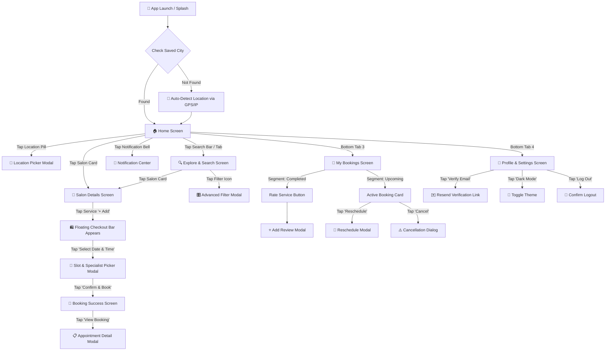
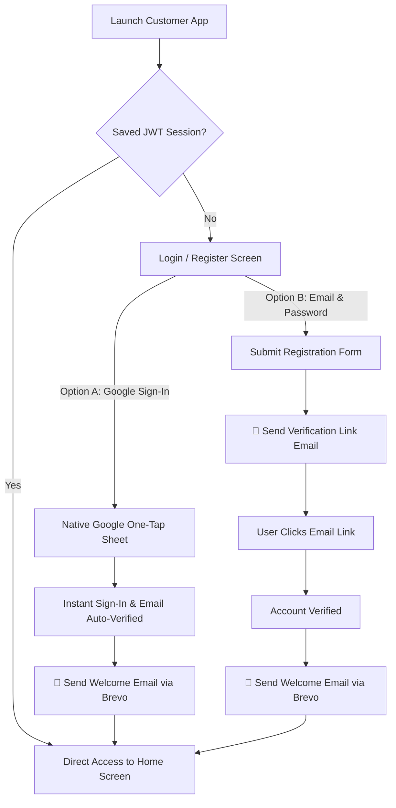

# 🎨 ST CUT Customer App — Comprehensive UI, UX & Page Flow Specification

> **Purpose**: Detailed UI/UX design, component breakdown, interactive flows, button placements, page transitions, and complete navigation architecture for Claude/human review.

---

## 🗺️ 1. Complete Application Page Map & Architecture

---

## 🔄 2. Step-by-Step Screen Transition & Navigation Flows

### 🌊 Flow A: Customer Onboarding & Discovery Flow
1. **App Launch Screen**:
   - Checks if user has a saved city in local storage (`@user_selected_city`).
   - **If first time opening**: Automatically calls `getCurrentLocation()`, reverse-geocodes GPS/IP to exact city name (e.g. *Bhubaneswar* or *Brahmapur*), and loads matching salons.
2. **Home Screen**:
   - User browses top-rated salons, category chips (*Haircut*, *Facial*, *Nails*), or promo banners.
   - User taps a **Salon Card** to transition to the **Salon Details Screen**.

---

### 🛍️ Flow B: Service Selection & Booking Flow
1. **Salon Details Screen**:
   - User views salon cover photo, rating (`★ 4.8`), hours (`Open Now`), and service list.
   - User taps **"+ Add"** on one or more services (e.g. *Haircut ₹299* + *Beard Trim ₹149*).
   - Button state toggles to solid gold **"✓ Added"**, and a **Floating Bottom Bar** smoothly slides up displaying: `"2 Services · ₹448" | [Select Date & Time →]`.
2. **Slot & Specialist Selection Modal**:
   - User taps **"Select Date & Time →"** button.
   - Modal slides up showing:
     - **Date Strip**: User taps date pill (e.g. `TODAY 25`).
     - **Specialist Strip**: User selects staff member (e.g. `Rahul - Master Barber`) or keeps `Any Specialist`.
     - **Time Grid**: User taps an available slot (e.g. `2:30 PM`). Selected slot turns solid gold (`2:30 PM ✓`).
3. **Booking Confirmation**:
   - User taps golden button at bottom: **"Confirm Booking (₹448)"**.
   - Backend creates booking via atomic MongoDB transaction, dispatches confirmation email & push notification.
   - User sees celebration success screen with button **"View My Bookings"**.

---

### 🔍 Flow C: Search & Advanced Filtering Flow
1. **Explore Screen**:
   - User taps search bar at the top or navigates via Bottom Tab 2.
   - User types in query (e.g., *"Facial"*). Suggestions update in real-time with a **300ms debounce**.
2. **Filter Modal**:
   - User taps the **Filter Icon `⚙️`** inside the search bar.
   - Modal opens with options: *Sort By* (Nearest, Highest Rated, Price Low-High), *Rating* (4.5+ Stars), *Price Tier* (₹ / ₹₹ / ₹₹₹).
   - User taps **"Apply Filters"** button -> Results update immediately.

---

### 📋 Flow D: Managing Bookings & Submitting Reviews
1. **Bookings Screen (Upcoming Segment)**:
   - User views scheduled appointments.
   - Tapping **"View QR / Details"** displays salon address, phone call button, and booking reference ID.
   - Tapping **"Cancel Appointment"** opens confirmation prompt.
2. **Completed Segment & Rating Flow**:
   - Once a salon marks an appointment `COMPLETED`, the card moves to the *Completed* tab.
   - A golden **"Rate Service"** button appears.
   - Tapping it opens `AddReviewModal` -> User selects 1 to 5 Gold Stars, writes feedback, and taps **"Submit Review"**.

---

## 🎨 3. Design System & Visual Palette

- **Primary Background**: `#0D0D0D` (Deep Onyx / Pure Dark)
- **Surface / Elevation 1**: `#1C1C1E` (Dark Charcoal for cards, sheets, modals)
- **Surface / Elevation 2**: `#2A2A2C` (Elevated borders, input fields, dividers)
- **Primary Accent / Brand**: `#D49B45` & `#C48B36` (Warm Metallic Gold gradient)
- **Text Primary**: `#FFFFFF` (Pure White)
- **Text Secondary**: `#A0A09C` / `#94A3B8` (Muted Slate / Silver)
- **Status Colors**:
  - **Success / Confirmed**: `#22C55E` (Emerald Green)
  - **Pending / Warning**: `#F59E0B` (Amber Gold)
  - **Cancelled / Error**: `#EF4444` (Crimson Red)

---

## 📱 4. Detailed Component & Button Placement Index

### 🏠 1. Home Screen Components
- **Location Selector (Header Top-Left)**: Map Pin `📍` + City Name + Chevron `▼`. Tapping opens `LocationPickerModal`.
- **Notification Bell (Header Top-Right)**: Bell icon `🔔` with red unread dot when notifications exist.
- **Promo Banner (Top)**: Hero image card with `"20% OFF FIRST BOOKING"` and **"Claim Now"** button.
- **Quick Rebook Capsule**: Displays last booked salon/service + golden **"Rebook"** 1-tap button.
- **Category Chips (Horizontal Bar)**: `"All"`, `"Haircut ✂️"`, `"Facials 🧴"`, `"Nails 💅"`, `"Spa 🌿"`.
- **Salon Card (`SalonCard.jsx`)**: Cover image, Rating badge (`★ 4.8`), Salon Name, Distance (`1.2 km`), Price (`₹299+`), **"Book Now"** button.

### 🏪 2. Salon Detail Screen Components
- **Header Buttons**: Back Arrow `←` (Top-Left circle) and Favorite Heart `❤️` (Top-Right circle).
- **Service Row**: Service image, Title, Duration (`⏱️ 30m`), Price (`₹499`), and **"+ Add"** / **"✓ Added"** toggle button.
- **Sticky Bottom Checkout Bar**: Displays total services + price + golden CTA **"Select Date & Time →"**.

### 📅 3. Slot Picker Modal Components
- **Date Selector**: Horizontal day cards (`TODAY 25`, `TUE 26`, `WED 27`).
- **Specialist Chips**: Avatar circles (`Any Specialist`, `Rahul`, `Priya`).
- **Time Slots Grid**: Morning, Afternoon, Evening time buttons (`10:30 AM`).
- **Bottom Footer CTA**: Golden button **"Confirm Booking (₹448)"**.

### 👤 4. Profile Screen Components
- **User Avatar & Verification Badge**: Avatar image + `✓ Email Verified` (Green) or `Verify Email` button.
- **Menu Items**: Dark Mode Toggle, Notification Preferences, Change Password, Log Out.

---

## 🔐 5. Authentication & Email Flow Architecture

