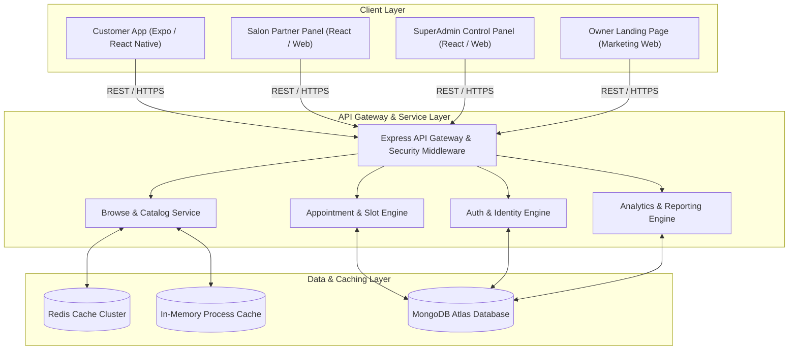
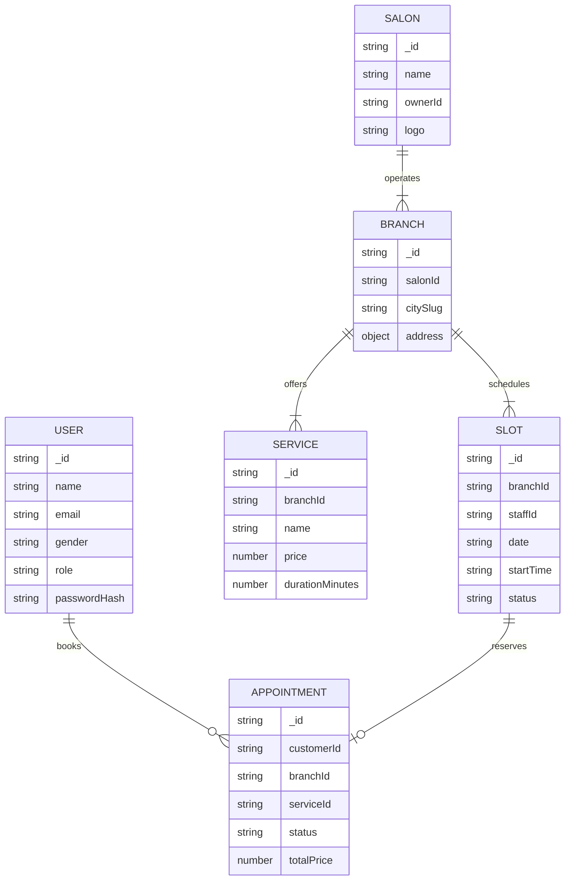
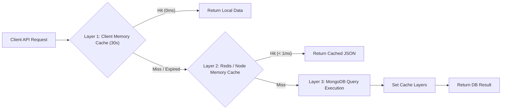
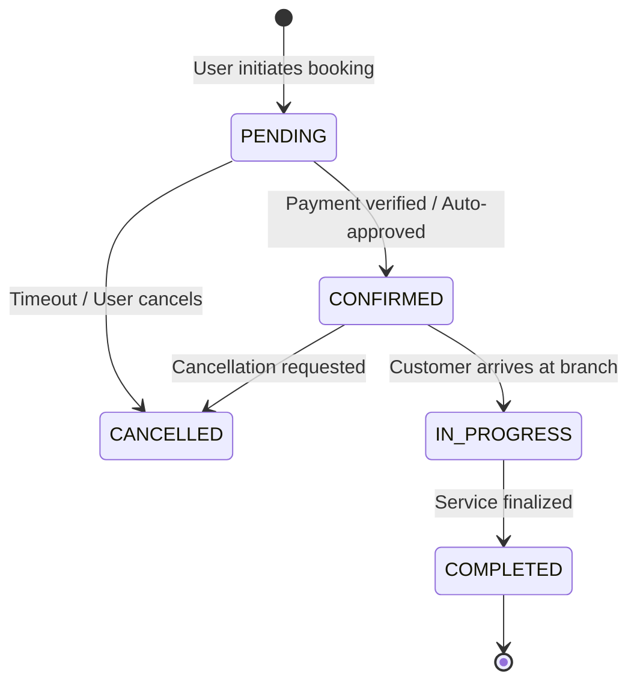

# Salon SaaS Platform - System Design & Architecture

High-level system design, data architecture, security models, real-time engines, and caching strategies governing the **Salon SaaS Platform** ecosystem.

---

## 1. High-Level Architecture Overview

The platform uses a decoupled Multi-Client Microservice Architecture. Frontends communicate with a centralized Node.js REST API backed by MongoDB, Redis Caching, and Cloud Infrastructure.

---

## 2. Applications & Subsystems Breakdown

### A. Customer App (`apps/customer-app`)
- **Technology Stack**: React Native (Expo), Zustand (State), React Navigation (Tabs + Stack), Vector Icons.
- **Key Subsystems**:
  - **Location & Geofencing**: Dual GPS + IP-based reverse geocoding with automatic city resolution (`locationService.js`, `useLocationStore.js`).
  - **Authentication Flow**: Google & Apple OAuth 2.0, Phone/Email JWT, Mandatory Gender collection on registration.
  - **Salon Discovery**: Multi-filter catalog (City, Category, Price Range, Min Rating, Search).
  - **Real-Time Booking**: Interactive slot selection, specialist selection, and re-booking widget.
  - **Client Optimization Engine**: In-flight HTTP request deduplication and 30s local memory caching (`apiClient.js`).

### B. Salon Partner Panel (`apps/salon-panel`)
- **Technology Stack**: React.js / Vite, TailwindCSS / CSS Modules, Chart.js.
- **Key Features**: Branch management, staff schedule configuration, service catalog management, live appointment queue, and daily/monthly revenue analytics.

### C. SuperAdmin Panel (`apps/admin-panel`)
- **Technology Stack**: React.js / Vite, Dashboard Framework.
- **Key Features**: Salon onboarding approval, subscription billing oversight, user deactivation management, platform-wide metrics.

### D. Backend API Service (`salon-api`)
- **Technology Stack**: Node.js, Express.js, Mongoose (MongoDB ODM), Redis (ioredis), Winston Logger.
- **Key Services**:
  - **Auth & Authorization**: JWT token rotation, bcrypt password hashing, RBAC (Customer, Staff, Manager, Admin, SuperAdmin).
  - **Cache Manager**: Hybrid Redis + Node process memory fallback (`cache.service.js`).
  - **Cache Warmer**: Async boot warmer (`cacheWarmer.js`) pre-populating high-frequency city endpoints.

---

## 3. Data Model & Database Architecture

MongoDB serves as the primary transactional database with the following core collections:

### Database Indexing Strategy
- **Service Collection**: Compound index `{ branchId: 1, isActive: 1, price: 1 }` for instant minimum price aggregation.
- **Branch Collection**: `{ citySlug: 1, isActive: 1 }` for location-scoped salon filtering.
- **Slot Collection**: `{ branchId: 1, date: 1, status: 1 }` for real-time slot availability lookups.

---

## 4. Multi-Tier Caching Architecture

To achieve sub-300ms network response times and **0ms local hits**, the platform uses a 3-layer caching pipeline:

1. **Layer 1 (Client App Memory Cache)**: `CLIENT_GET_CACHE` in `apiClient.js` stores responses in mobile app memory (30s TTL). Returns in **0ms**.
2. **Layer 2 (Server Dual-Tier Cache)**: `getCache()` checks Redis cluster first. If Redis is unavailable or cold, falls back to `IN_MEMORY_FALLBACK_CACHE` inside Node process memory. Returns in **< 1ms**.
3. **Layer 3 (Database Execution)**: MongoDB executes parallelized `Promise.all` queries with compound indexes when Layer 1 & Layer 2 miss.

---

## 5. Security & Authentication Architecture

- **Token Strategy**: Short-lived Access Tokens (JWT, 15 mins) paired with HTTP-only Refresh Tokens (7 days).
- **Silent Refresh Flow**: `apiClient.js` intercepts HTTP 401 status codes and silently requests `/auth/refresh` without interrupting the user experience.
- **OAuth 2.0 Integration**: Native Google Sign-In and Apple Sign-In authentication providers.
- **Input Validation**: Strict request payload validation using `express-validator` (e.g. mandatory gender field on registration, sanitized regex inputs).

---

## 6. Appointment Booking & State Machine

Appointments follow a strict transactional state lifecycle to prevent double-booking:

- **Slot Lock Engine**: When a user selects a slot, the system locks the target `Slot` record atomically using Mongo transactions or status flags (`status: 'RESERVED'`).
- **Conflict Prevention**: Overlapping slot requests for the same specialist/branch are rejected with `409 Conflict` before payment initialization.

---

## 7. Scalability & Deployment Infrastructure

- **Containerization**: Docker & Docker Compose (`docker-compose.yml`) for unified containerized orchestration.
- **Cloud Hosting**: Deployed on Railway Cloud / AWS with automated environment scaling.
- **Stateless API Design**: The Express backend is fully stateless, allowing horizontal scaling across multiple container instances behind a cloud load balancer.
